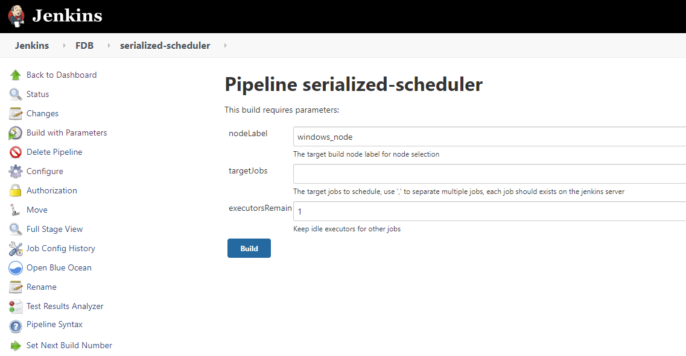

Jenkins Serial Scheduler
=================

Do you want to schedule a batch of similar Jenkins jobs?

Maybe it's not a problem, but if you have limited executors 
and at the same time with some expected timeout for each job. You are likely want this scheduler.

# How To Use
### Prerequisites
* A Jenkins instance installed
* Pipeline is supported
* Setup a Jenkins credential for the access to Jenkins server by api  

### Setup
#### Setup Common Scheduler
Create a "Pipeline" Jenkins project with the [Jenkinsfile](File:Jenkinsfile), replace the two variables related:
to specific environment:
 * Server_URL: the Jenkins URL, e.g. https://www.jenkins.io, which is used to check the available executors.
 * Jenkins_Auth: the Jenkins credential for access the Jenkins server by api.
 
#### Common Scheduler Parameters
There are 3 parameters:
 * **nodeLabel**: the label to select Jenkins nodes that you want to run your jobs.
 * **targetJobs**: the job list that you want to schedule in sequence.
 * **executorsRemain**: for overall Jenkins availability consideration, this scheduler support remain some capacity for other jobs.
   

#### Usage Example
[ExampleJenkinsfile](File:ExampleJenkinsfile) is an example Jenkinsfile to use this common scheduler. 

 
